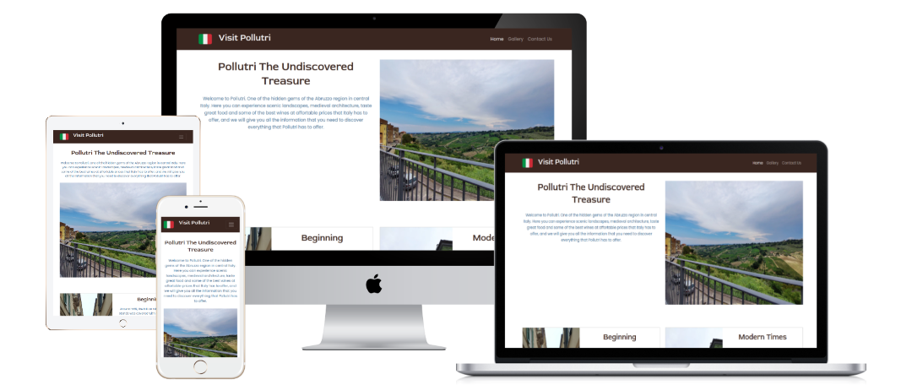
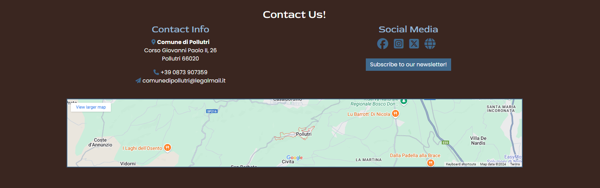
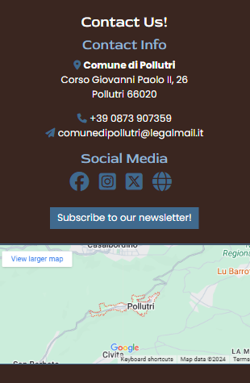
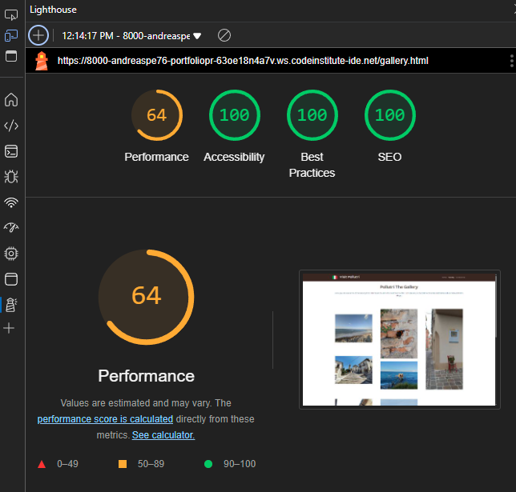

# Visit Pollutri

Visit Pollutri is a site aiming to introduce to it's audience, a part of Italy mainly unknown by most. It introduces the Abruzzo region, and more specifically Pollutri, a village in the region which is like a small central hub, near to many other interesting sites. The target audience are those who want something different from the classic Toscana and Roma tourist destinations, and who want to experience Italy, without the negatives that popular tourist destinations suffer from. 

My hope is that the site will be useful to those people, by providing basic information about Pollutri, some information for attractions in the near area of Pollutri to get people going, and pictures which will start up their curiosity for the region and challenge them to explore more. 

## Features

- __Navigation Bar__

   - The navigation Bar is featured in both pages, it is fully responsive and includes links to the Logo, Home page, Gallery and offers easy access to the contact information at the footer of the site.
   - It is identical in both pages, fixed at the top for easy access without the need to scroll up and allows for easy navigation, without the use of the browser back button.

  

       

- __Header section__

   - The header section consists of a small paragraph that serves as an intro to Pollutri and an image of the landscape outside the village.

- __Main__

   - The main section consists of three parts:

   - The history of Pollutri, giving a few information about it's beginning.
   - The today part, that has information of the modern Pollutri.
   - The to-do part that gives some ideas about interesting sites in the area around Pollutri.

All three parts consist of a small paragraph and an image of the village or other sites in the area.
The min section is valuable to the user, as it gives brief but interesting information about the past, present and life in Pollutri and the general area.

- __Footer__

   - The footer has the contact information of the Pollutri municipality office.
   - Social media links which open into new tabs when clicked on.
   - A subscribe to a newsletter button that opens a modal that require the name and email of the visitor plus a small message which is not mandatory.

The footer like the nav bar is also fully responsive.
The footer is valuable to the user, as it gives contact info for the Pollutri municipality in case they want to get in contact, quick access to the various social media that concern Pollutri and gives the possibility to subscribe to an informational newsletter if they so wish it.

 

 

- __Gallery__

   - The gallery provides the user with images, so that they can see interesting architecture and landmarks in the area.

## Testing

### Validator Testing

   - HTML
     - No errors were found on the index page by the official [W3C validator](https://validator.w3.org/nu/?doc=https%3A%2F%2Fandreaspe76.github.io%2FPortfolio-_Project_1%2Findex.html)

     - No errors were found on the gallery page by the official [W3C validator](https://validator.w3.org/nu/?doc=https%3A%2F%2Fandreaspe76.github.io%2FPortfolio-_Project_1%2Fgallery.html)

   - CSS
     - No errors were found on the index page by the official [W3C CSS validator](https://jigsaw.w3.org/css-validator/validator?uri=https%3A%2F%2Fandreaspe76.github.io%2FPortfolio-_Project_1%2Findex.html&profile=css3svg&usermedium=all&warning=1&vextwarning=&lang=en) 

     - No errors were found on the gallery page by the official [W3C CSS validator](https://jigsaw.w3.org/css-validator/validator?uri=https%3A%2F%2Fandreaspe76.github.io%2FPortfolio-_Project_1%2Fgallery.html&profile=css3svg&usermedium=all&warning=1&vextwarning=&lang=en) 

   - Lighthouse
     - The pages were also validated using Lighthouse in the MS Edge dev tools.

 

### Unfixed Bugs

There are no known unfixed bugs.

## Deployment

- The site was deployed to GitHub pages. The steps to deploy are the following:
   - In the GitHub repository, navigate to the Settings tab.
   - From the source section drop-down menu, select the Master Branch.
   - Once the master branch has been selected, the page will be automatically refreshed with a detailed ribbon display to indicate the successful deployment.

The live link can be found here - https://andreaspe76.github.io/Portfolio-_Project_1/index.html

## Credits 

### Content 

- Information for the text in the Beginning card was taken from Wikipedia's Pollutri article.
- Design ideas for the site were taken by both the "Love running" and "Boardwalk games projects"
- The icons in  the navbar and footer were taken from [Font Awesome](https://fontawesome.com/)
- The colors used in the site were taken from a photo using [Image color picker](https://imagecolorpicker.com/)
- Bootstrap 5.3.3 was extensively used, as it offers a fast and easy way to implement various parts of the site, with aesthetically appealing results.
- For the README file I used as a template mainly the example provided by Code institute.

### Media

- The photos used on the home and gallery page, belong to me.

### Special thanks

- Special thanks need to go to my code institute mentor, Rory Patrick Sheridan whose help and guidance was invaluable.
  - He guided me with certain design ideas, for the web site.
  - Helped me solve an issue I had with the newsletter modal, which did not validate that it's fields were correctly filled before submitting.
  - Also helped me to use the code institute form validation page for the modal after being submitted.
  - Finally he gave me examples and guidance in creating the README file.